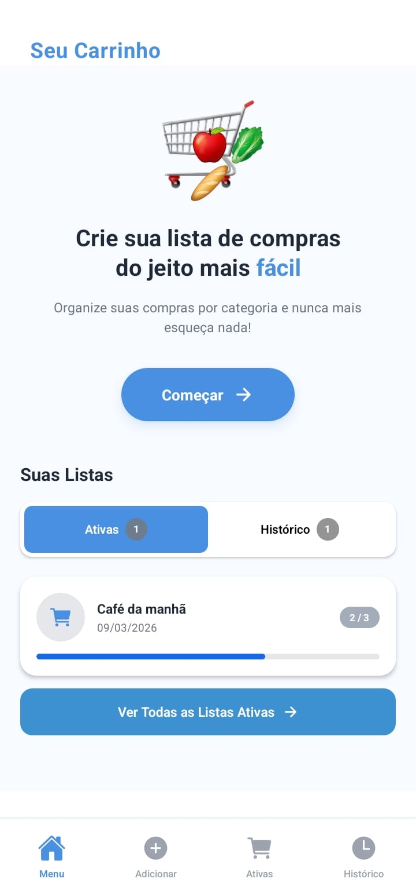
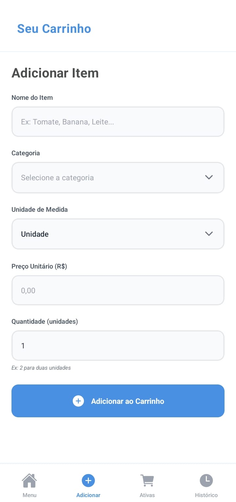
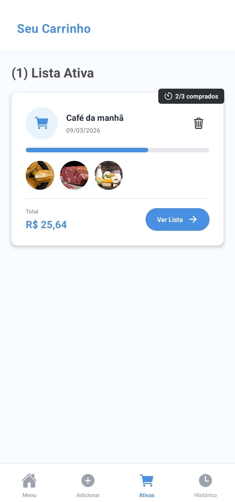
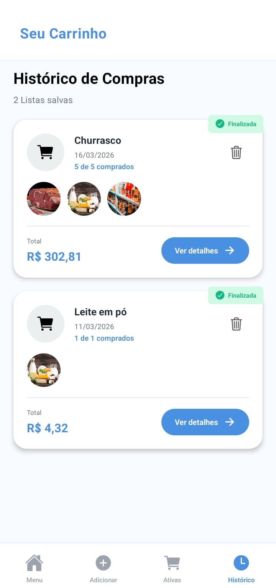

# Seu Carrinho

This app allows you to create custom supermarket shopping lists. You can add items and mark them as bought as you shop. All lists are saved in the hstory screen, allowing you to review your weekly or monthly purchases.

This app was developed using Expo Go and Android Studio for the build process, with JavaScript and React Native.

## Screenshots

  
  
   
   

